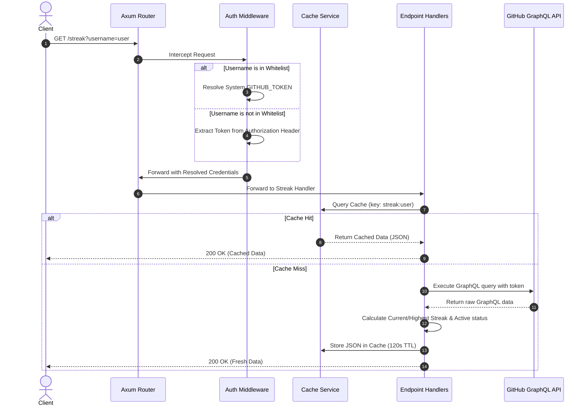

# Iceberg

A fast, lightweight, and modern **GitHub activity tracking API** written in Rust using **Axum** and **Tokio**. This project is a complete rewrite of the original Go-based [Katib](https://github.com/JasonLovesDoggo/Katib) service. It replicates all features including GraphQL-based GitHub requests, contribution streak calculation, language distribution normalization, and endpoint caching.

## Features

- **High Performance**: Built with Rust, Axum, and Tokio for minimal memory footprint and fast response times.
- **Embedded Documentation**: Serves the API docs at the root URL (`/`) directly from the binary.
- **Robust Cache Layer**: Features an in-memory cache with a 120-second TTL to respect GitHub GraphQL API rate limits.
- **Contribution Streak Tracking**: Calculates current and highest contribution streaks based on the user's daily activity calendar.
- **Language Normalization**: Restructures repo language distribution sizes (redistributing dominant languages representing >80% of volume) to look cleaner and more representative on developer portfolio pages.
- **Secure Authentication Model**: Uses a system-wide `GITHUB_TOKEN` for whitelisted users, while allowing other users to authenticate with their own Personal Access Token (PAT) via an `Authorization: Bearer <PAT>` header.

---

## Architecture Flow

The following diagram illustrates how incoming requests are processed, authenticated, cached, and resolved:



---

## API Documentation

### 1. Root / Interactive API Documentation
- **Endpoint**: `GET /`
- **Description**: Returns the embedded HTML documentation page detailing all endpoints.

### 2. Healthcheck
- **Endpoint**: `GET /healthcheck`
- **Method**: `GET`
- **Response**:
  ```json
  {
    "status": "ok"
  }
  ```

### 3. Latest Commit (v1)
- **Endpoint**: `/commits/latest`
- **Method**: `GET`
- **Query Parameters**:
  - `username` (Required): The GitHub username to fetch stats for.
- **Headers**:
  - `Authorization: Bearer <YOUR_PAT>` (Required only if the username is not in the system whitelist).
- **Response Example**:
  ```json
  {
    "repo": "owner/repo-name",
    "additions": 45,
    "deletions": 12,
    "commitUrl": "https://github.com/owner/repo-name/commit/abc123xyz...",
    "committedDate": "2026-06-13T12:00:00Z",
    "oid": "abc123x",
    "messageHeadline": "feat: add user authentication",
    "messageBody": "Implements OAuth2 authentication handlers...",
    "languages": [
      { "size": 15000, "name": "Rust", "color": "#dea584" },
      { "size": 3200, "name": "TypeScript", "color": "#3178c6" }
    ],
    "parentCommits": []
  }
  ```

### 4. Recent Commits History (v2)
- **Endpoint**: `/v2/commits/latest`
- **Method**: `GET`
- **Query Parameters**:
  - `username` (Required): The GitHub username.
  - `limit` (Optional, default `10`): Max number of commits to return.
- **Response Example**:
  ```json
  {
    "commits": [
      {
        "repo": "owner/repo-name",
        "additions": 23,
        "deletions": 5,
        "commitUrl": "https://github.com/.../commit/...",
        "committedDate": "2026-06-13T12:00:00Z",
        "oid": "abc123x",
        "messageHeadline": "fix: resolve memory leak",
        "messageBody": ""
      }
    ],
    "languages": [
      { "size": 18200, "name": "Rust", "color": "#dea584" }
    ],
    "stats": {
      "totalAdditions": 23,
      "totalDeletions": 5,
      "totalCommits": 1
    }
  }
  ```

### 5. Contribution Streak
- **Endpoint**: `/streak`
- **Method**: `GET`
- **Query Parameters**:
  - `username` (Required): The GitHub username.
- **Response Example**:
  ```json
  {
    "currentStreak": 14,
    "highestStreak": 45,
    "active": true
  }
  ```

---

## Configuration

Environment variables can be supplied using a `.env` file in the root directory:

| Variable | Description | Default |
| :--- | :--- | :--- |
| `PORT` | The port the application server binds to | `8080` |
| `GITHUB_TOKEN` | System-wide Personal Access Token used for whitelisted accounts | None |
| `WHITELIST` | Comma-separated list of lowercase usernames exempt from providing their own tokens | None |

---

## Getting Started

### Prerequisites
- Install **Rust** (MSRV 1.75+)
- Obtain a **GitHub Personal Access Token (PAT)**:
  - Settings -> Developer Settings -> Personal Access Tokens (Fine-grained or Classic).
  - No special scopes are required for retrieving public contributions/commits.

### Running Locally
1. Clone the repository and navigate to the project directory.
2. Create your `.env` file from the template:
   ```bash
   cp .env.example .env
   ```
3. Open `.env` and fill in your `GITHUB_TOKEN`.
4. Run the development server:
   ```bash
   cargo run
   ```
5. Test the application in your browser:
   - Docs page: `https://iceberg.penqguin.com/`
   - Test whitelisted user commit: `https://iceberg.penqguin.com/commits/latest?username=penqguin`
   - Test health check: `https://iceberg.penqguin.com/healthcheck`

---

## Docker Deployment

You can build and run the application in a secure Docker container:

### Build Image
```bash
docker build -t iceberg .
```

### Run Container
```bash
docker run -p 8080:8080 --env-file .env iceberg
```

## License

This project is licensed under the MIT License. See the [LICENSE](LICENSE) file for details.
