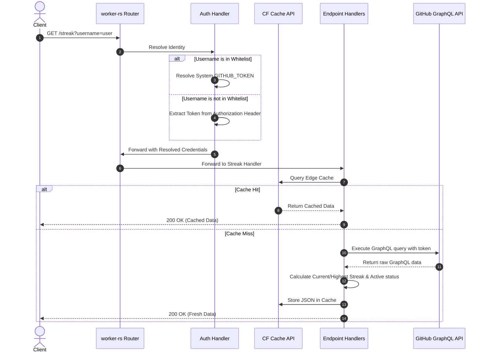

# Iceberg

A fast, lightweight, and modern **GitHub activity tracking API** built as a **Cloudflare Worker** using **Rust** and `worker-rs`. This project is a complete rewrite of the original Go-based [Katib](https://github.com/JasonLovesDoggo/Katib) service. It replicates all features including GraphQL-based GitHub requests, contribution streak calculation, language distribution normalization, and edge-side caching.

## Features

- **Edge Performance**: Deploys as a Cloudflare Worker for global low-latency and minimal cold starts.
- **Embedded Documentation**: Serves the API docs at the root URL (`/`) directly from the Worker.
- **Cloudflare Cache API**: Integrates with the native Cache API for high-performance, edge-local caching.
- **Contribution Streak Tracking**: Calculates current and highest contribution streaks based on the user's daily activity calendar.
- **Language Normalization**: Restructures repo language distribution sizes (redistributing dominant languages representing >80% of volume) to look cleaner and more representative on developer portfolio pages.
- **Secure Authentication Model**: Uses a system-wide `GITHUB_TOKEN` for whitelisted users, while allowing other users to authenticate with their own Personal Access Token (PAT) via an `Authorization: Bearer <PAT>` header.
- **Global CORS**: Configured to allow requests from any origin (`*`) while remaining secure through token-based authentication.

---

## Architecture Flow

The following diagram illustrates how incoming requests are processed, authenticated, cached, and resolved:



---

## API Documentation

### 1. Root / Interactive API Documentation
- **Endpoint**: `GET /`
- **Description**: Returns the embedded HTML documentation page detailing all endpoints.

### 2. Healthcheck
- **Endpoint**: `GET /healthcheck`
- **Method**: `GET`
- **Response**:
  ```json
  {
    "status": "ok"
  }
  ```

### 3. Latest Commit (v1)
- **Endpoint**: `/commits/latest`
- **Method**: `GET`
- **Query Parameters**:
  - `username` (Required): The GitHub username to fetch stats for.
- **Headers**:
  - `Authorization: Bearer <YOUR_PAT>` (Required only if the username is not in the system whitelist).

### 4. Recent Commits History (v2)
- **Endpoint**: `/v2/commits/latest`
- **Method**: `GET`
- **Query Parameters**:
  - `username` (Required): The GitHub username.
  - `limit` (Optional, default `10`): Max number of commits to return in the list.
  - `history_limit` (Optional, default `10`): Number of commits to scan per repo for statistics (additions/deletions/languages).
- **Response Example**:
  ```json
  {
    "commits": [
      {
        "repo": "owner/repo-name",
        "additions": 23,
        "deletions": 5,
        "commitUrl": "https://github.com/.../commit/...",
        "committedDate": "2026-06-13T12:00:00Z",
        "oid": "abc123x",
        "messageHeadline": "fix: resolve memory leak",
        "messageBody": ""
      }
    ],
    "languages": [
      { "size": 18200, "name": "Rust", "color": "#dea584" }
    ],
    "stats": {
      "totalAdditions": 23,
      "totalDeletions": 5,
      "totalCommits": 1
    }
  }
  ```

### 5. Contribution Streak
- **Endpoint**: `/streak`
- **Method**: `GET`
- **Query Parameters**:
  - `username` (Required): The GitHub username.

---

## Configuration

Environment variables are managed via `wrangler.toml` (for production) or a `.env` file (for local development):

| Variable | Description |
| :--- | :--- |
| `GITHUB_TOKEN` | System-wide Personal Access Token used for whitelisted accounts |
| `WHITELIST` | Comma-separated list of lowercase usernames exempt from providing their own tokens |

---

## Getting Started

### Prerequisites
- Install **Rust**
- Install **Wrangler** (`npm install -g wrangler`)
- Install **worker-build** (`cargo install worker-build`)
- Obtain a **GitHub Personal Access Token (PAT)**

### Running Locally
1. Clone the repository and navigate to the project directory.
2. Create your `.env` file from the template:
   ```bash
   cp .env.example .env
   ```
3. Open `.env` and fill in your `GITHUB_TOKEN` and `WHITELIST`.
4. Run the development server using Wrangler:
   ```bash
   wrangler dev
   ```
5. Test the application locally (usually at `http://localhost:8787`):
   - Docs page: `http://localhost:8787/`
   - Test whitelisted user commit: `http://localhost:8787/commits/latest?username=penqguin`

---

## Deployment

### Deploy to Cloudflare
```bash
wrangler deploy --env production
```

### Docker Deployment
The project includes a `Dockerfile` that packages the Worker and Wrangler for containerized environments (useful for CI or localized edge testing):

```bash
docker build -t iceberg .
docker run -p 8080:8080 --env-file .env iceberg
```

## License

This project is licensed under the MIT License. See the [LICENSE](LICENSE) file for details.
